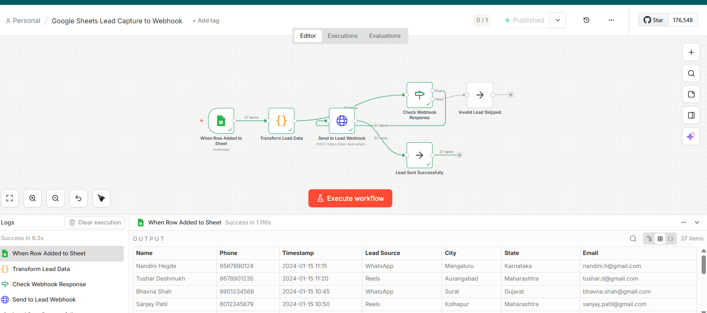
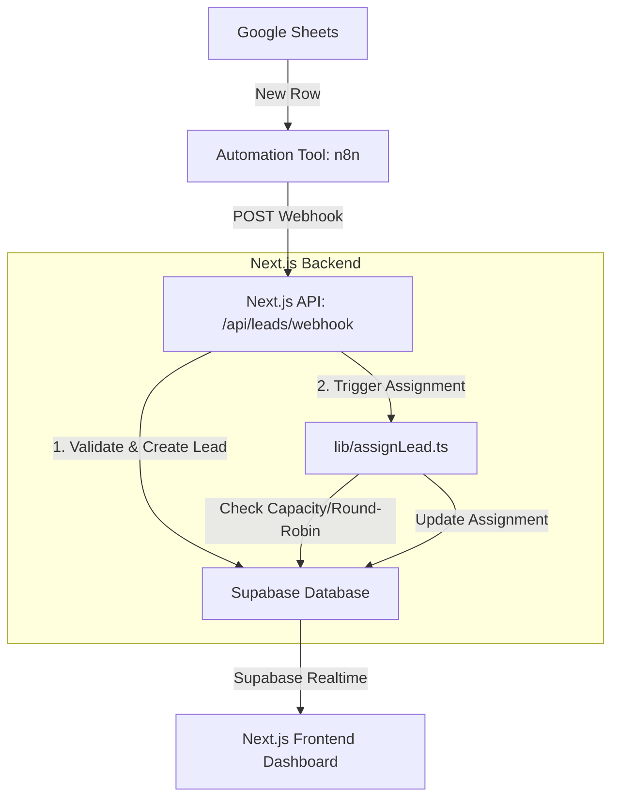

# Bloc CRM - AI & Automation Developer Assignment

This project is a real-time Sales CRM web application built for the Bloc Founding AI & Automation Developer Assignment. It handles automated lead ingestion from Google Sheets, real-time UI synchronization, and smart round-robin lead assignment based on caller availability, daily limits, and regional state assignments.

## 🔗 Submission Links
- **Live Deployment:** [(https://bloc-test-e4q4.vercel.app/leads)]]
- **Google Sheets (Test Leads):** [[https://docs.google.com/spreadsheets/d/1S0RYoyddqW-gN4OfeIjAL7wdOrNWjvcrH9RwJ__X1po/edit?usp=sharing)](]
- **Video Demo:** [[(https://drive.google.com/drive/folders/1p0S0avCUvjGW_wKm9FF3fQbIE2ZqVNKR?usp=sharing)]]

## 🚀 Setup Instructions

1. **Clone the repository:**
   ```bash
   git clone <your-repo-link>
   cd bloc-test
   ```

2. **Install dependencies:**
   ```bash
   npm install
   # or yarn install
   ```

3. **Database Setup (Supabase):**
   - Create a new project on [Supabase](https://supabase.com).
   - Go to the SQL Editor and run the queries found in `schema.sql` (located in the root of this project) to create the tables, functions, and policies.
   - Note: The SQL ensures `leads` has realtime enabled. Double check in Supabase (Database -> Publications -> `supabase_realtime`) that `leads` is checked.

4. **Environment Variables:**
   Create a `.env.local` file in the root directory and add the following:
   ```env
   NEXT_PUBLIC_SUPABASE_URL=your_supabase_project_url
   NEXT_PUBLIC_SUPABASE_ANON_KEY=your_supabase_anon_key
   SUPABASE_SERVICE_ROLE_KEY=your_supabase_service_role_key
   WEBHOOK_SECRET=your_secure_webhook_secret
   ```

5. **Run the Development Server:**
   ```bash
   npm run dev
   ```
   - Open [http://localhost:3000](http://localhost:3000) for the Dashboard.
   - Open [http://localhost:3000/api-docs](http://localhost:3000/api-docs) for the **Interactive API Documentation (Swagger)**.


---

## ⚡ Automation Workflow

### How Automation is Triggered
The automation begins when a new row is added to a designated Google Sheet.
1. The AI Automation Tool (e.g., n8n, Zapier, Make) listens for the "New Spreadsheet Row" event.
2. It extracts the row data (Name, Phone, Timestamp, Lead Source, City, State).
3. It makes a `POST` request to the Next.js API route (`/api/leads/webhook`) with the payload and a secure `x-hook-key` header matching the `WEBHOOK_SECRET`.
4. The backend securely verifies the request, checks for duplicate phone numbers, inserts the lead into Supabase, and triggers the Round Robin assignment logic. Supabase Realtime then instantly pushes the new lead to the frontend UI without requiring a refresh.

### Automation Screenshot


---

## 🧠 System Architecture & Database Logic




### Development Logic
The assignment logic (`lib/assignLead.ts`) operates on every new lead insertion:
1. **State Matching**: Finds all active callers whose `assigned_states` array contains the lead's state.
2. **Fallback**: If no caller matches the state, it falls back to a global pool of all active callers.
3. **Capacity Check**: Checks the `daily_counters` table. It filters out any callers who have reached their `daily_limit` for the current date. (If all callers are capped, the lead is marked `unassigned`).
4. **Atomic Round-Robin Indexing**: To prevent race conditions when multiple leads arrive simultaneously, it calls a Supabase Postgres RPC function (`get_next_rr_index`). This increments an atomic counter specific to the state (or global fallback).
5. **Selection & Transaction**: The index modulus (`actualIndex = current_index % eligible.length`) guarantees fair round-robin distribution. The function then updates the `leads` table, upserts the `daily_counters`, and inserts a record into `assignments_log`.

### Database Structure
The system relies on Postgres (via Supabase) with the following core tables:
- `callers`: Stores agent profiles, limits, active status, languages, and assigned states.
- `leads`: Stores lead data, their assignment status (`new`, `assigned`, `unassigned`), and the ID of the assigned caller.
- `daily_counters`: Records the number of leads assigned to each caller per day (resets daily).
- `rr_state_index`: Tracks the current round-robin counter for each state to ensure fair distribution.
- `assignments_log`: An audit trail of all assignment decisions.

*See `schema.sql` for the exact table schemas and the Postgres RPC function.*

---

## 💡 What I Would Improve With More Time

While the system is fully functional and meets all assignment criteria, a production environment would benefit from:
1. **Concurrency Refinement**: Using PostgreSQL transactions (or moving the entire assignment logic into an edge-safe Postgres trigger/function) to ensure 100% ACID compliance if thousands of leads arrive in the exact same millisecond.
2. **Authentication**: Implementing robust role-based access control (RBAC) via NextAuth or Clerk so only authorized admins can access the `/leads` and `/callers` dashboard.
3. **Agent Dashboard**: A dedicated view for callers where they can log in and see only their assigned leads, update lead statuses (e.g., "Contacted", "Converted"), and make notes.
4. **WebSocket Fallback**: Currently relying on Supabase Realtime. Adding a robust retry/reconnect wrapper in the frontend context to handle spotty internet connections.
5. **Data Normalization:** Add a robust mapping layer in the webhook to handle slightly misspelled state names coming from user-inputted Google Forms.
